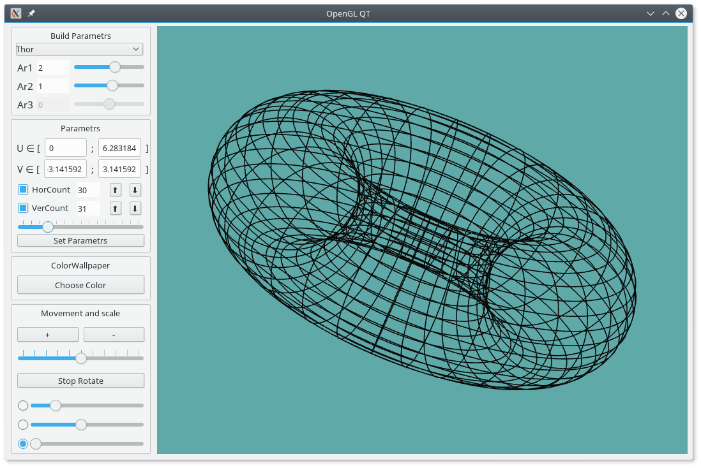
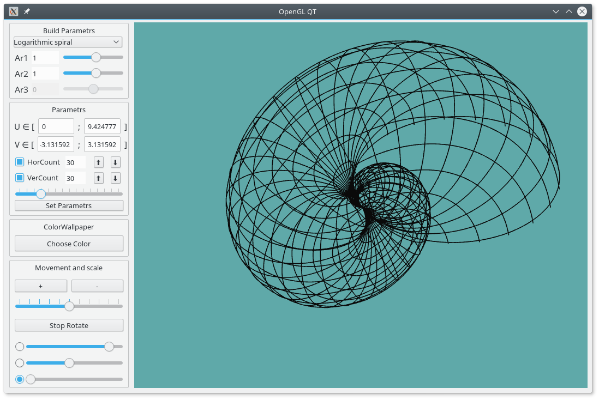

# OpenGLQT
OpenGL QT Geometric modeling
Построение геометрических фигур по параметрическим функциям.

Установка:
install QT Creator:
Download the Qt Online Installer 
https://www.qt.io/download-open-source
Важно:
Выбрать в установке компоненты версии QT5 (QT GL)

